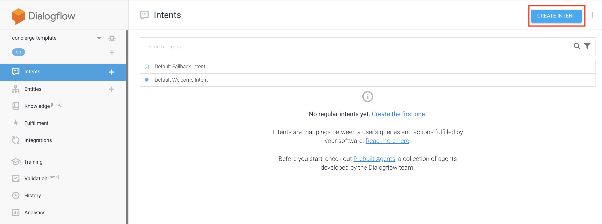
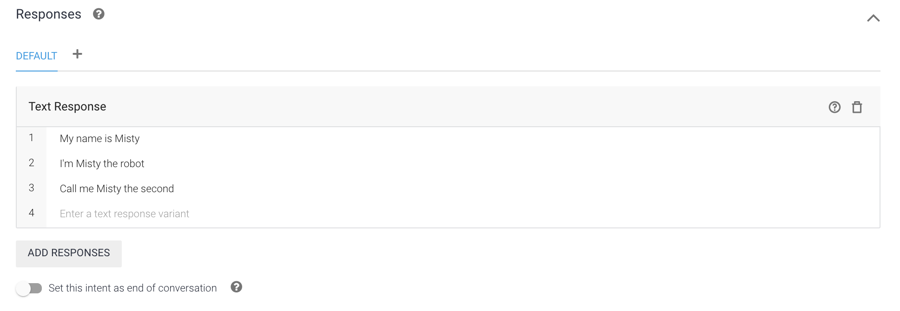
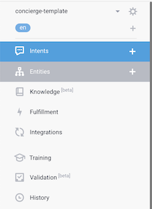
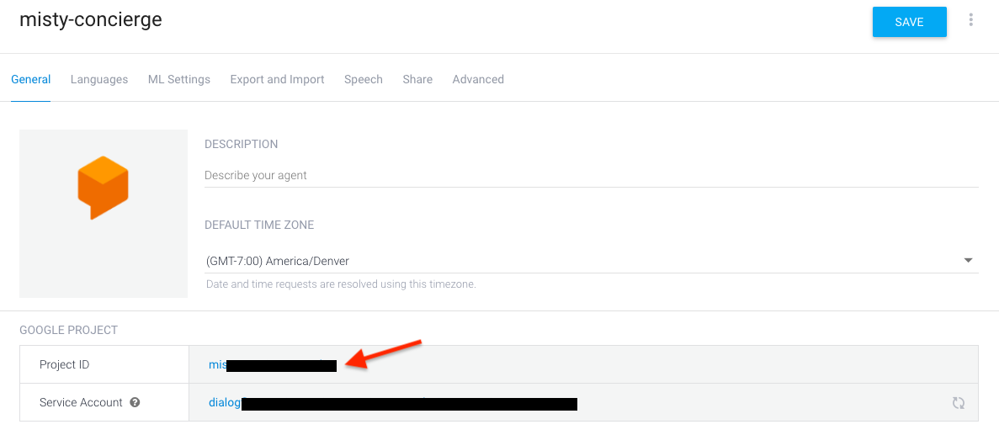
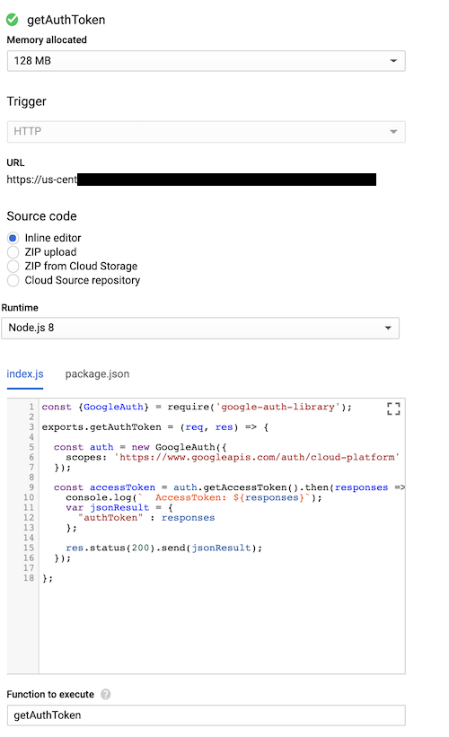
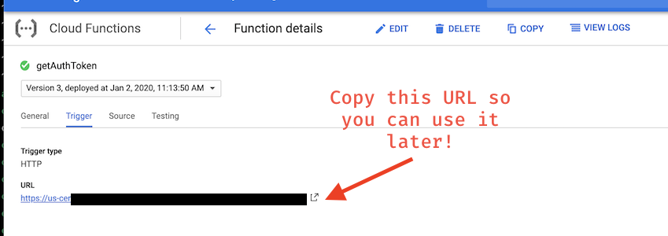
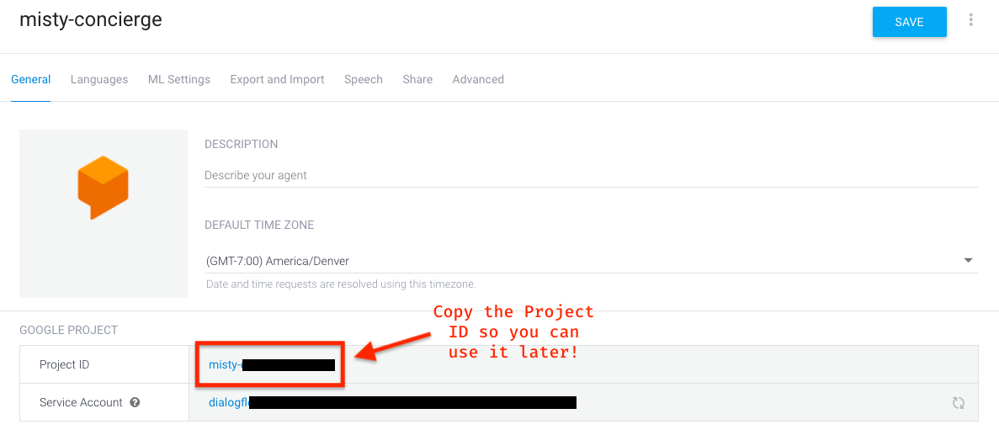
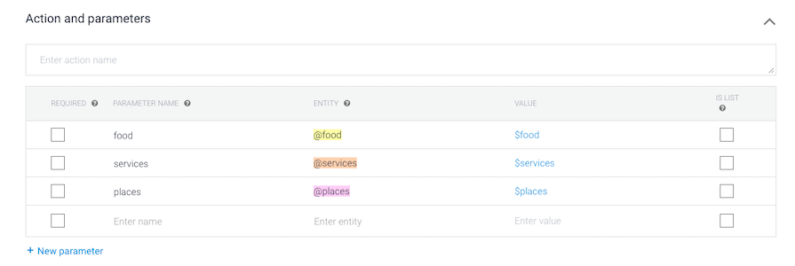

# JavaScript Templates

The **Misty Concierge JavaScript Templates** are open-source JavaScript skill templates for Misty II robots. As a Misty developer, you can use this code and documentation to quickly build and deploy skills that put Misty to work as a concierge in industries like hospitality, healthcare, education, eldercare, commercial real estate, retail, marketing, and even museums.

The templates in this directory focus on *information sharing*. They integrate with Dialogflow to give Misty the ability to handle voice interactions, answer questions, and look up information. As she listens and responds, Misty maintains eye contact with the speaker, moves her head and arms, blinks her LED, plays sounds, and changes her expression to invite engagement and delight those who speak to her.

You can extend these templates to put Misty to work in countless innovative ways. Here are a few examples:

* Misty could answer questions about local events, what's on the menu for dinner, or what the weather is like.
* She could take reservations and order tickets, or help with room service orders via further integrations with 3rd party services and point-of-sale systems.
* You could ask Misty to book cars or taxis.
* Misty could tell fun facts, tell jokes, or play games.
* You could ask Misty to page someone by sending an SMS through a service like Twilio.
* With other IoT integrations, Misty could control your smart home devices.
* Misty could be a personal assistant who can review your schedule and set reminders.

## Table of Contents

This guide provides all of the information you need to start using the JavaScript concierge template with your own Misty II.

- [JavaScript Templates](#javascript-templates)
  - [Table of Contents](#table-of-contents)
  - [Overview](#overview)
    - [Requirements](#requirements)
  - [conciergeBaseTemplate Guide](#conciergebasetemplate-guide)
    - [Creating a Dialogflow Agent](#creating-a-dialogflow-agent)
    - [Custom Intents and Entities](#custom-intents-and-entities)
      - ["name" Intent](#%22name%22-intent)
      - ["menu" Intent](#%22menu%22-intent)
    - [Creating an Access Token Function](#creating-an-access-token-function)
    - [Enabling the Text-to-Speech API](#enabling-the-text-to-speech-api)
    - [Updating your Credentials](#updating-your-credentials)
    - [Updating your Skill Code](#updating-your-skill-code)
    - [Installing your Skill](#installing-your-skill)
    - [Next Steps](#next-steps)
  - [conciergeFoursquareTemplate Guide](#conciergefoursquaretemplate-guide)
    - [Importing a Dialogflow Agent](#importing-a-dialogflow-agent)
      - [Predefined Entities](#predefined-entities)
      - [Predefined Intents](#predefined-intents)
    - [Setting Up Foursquare](#setting-up-foursquare)
    - [Updating your Credentials](#updating-your-credentials-1)
    - [Understanding the Skill Code](#understanding-the-skill-code)
    - [Installing the Skill](#installing-the-skill)
  - [Remarks](#remarks)
    - [Using Dialogflow Audio Output to Decrease Latency](#using-dialogflow-audio-output-to-decrease-latency)
    - [Using the JSON Meta Files](#using-the-json-meta-files)

## Overview

This **JavaScript** template directory includes the following resources:

* **conciergeBaseTemplate** - A basic template for the concierge use case.  The `conciergeBaseTemplate.js` code file provides the framework for sending audio files to Dialogflow and handling the Dialogflow response data. Use this template to start building custom voice interactions for your Misty II robot.
* **conciergeFoursquareTemplate** - An extension of the base template that shows how Misty can suggest nearby food, places, and services by using Dialogflow response data to make a request to the Foursquare Places API. Use this template as an example of how to use third-party services with your concierge skills.
* **dialogflow** - Includes a .zip file with JSON data for predefined intents and entities that you can import into a Dialogflow agent. (For use with the `conciergeFoursquareTemplate` skill).

This guide provides instructions for using the code for the `conciergeBaseTemplate` and the `conciergeFoursquareTemplate` with your Misty II. If this is your first time using the template, we recommend starting with the base template to learn how Dialogflow works with your skill code. If you've already got the base template up-and-running, feel free to skip ahead to the Foursquare template guide.

### Requirements

To use the templates in this repository, you need a Misty II robot running `robotVersion 1.8.4` or higher, with the [2020.01.07 Android patch](https://community.mistyrobotics.com/t/2020-01-07-misty-ii-android-patch-for-improved-slam-performance/2415) applied.

***Note:** Some of the commands and event types used in these templates are **beta**, and related hardware, firmware, and software is still under development. Please recognize that these skills may behave unpredictably at this time, and their range of capabilities is likely to change as Misty improves. If you have questions about getting started, or if you run in to issues with the contents of this repository, we encourage you to [post in the Misty Community Forums](https://community.mistyrobotics.com/t/application-template-misty-as-a-concierge/2414)!*

## conciergeBaseTemplate Guide

When the `conciergeBaseTemplate` skill runs, you can activate Misty with her wake word ("Hey, Misty!") to start talking to the robot. Misty turns to face you and moves her head to maintain eye contact while you speak. When you finish talking, Misty captures your speech in an audio file and sends this recording to be analyzed by your own custom Dialogflow agent. Dialogflow returns a data object you can use in your skill to program Misty's response to different questions and statements. Read this section to learn how to:

* create a Dialogflow agent with *intents* for handling a few basic types of questions that people might ask your robot
* use Google Cloud Functions to automatically generate a token for use with Google's services each time the concierge skill runs
* enable the Google text-to-speech API for use with your skill
* code how Misty reacts to different responses from Dialogflow
* update the `conciergeBaseTemplate.js` skill code with your own credentials and run the skill on your Misty II

Start by forking, cloning, or downloading this repository to your local machine. Once you have a copy of the JavaScript template files to work with, read the next section to learn how to create your own Dialogflow agent.  

### Creating a Dialogflow Agent

Dialogflow is a natural language processing service for building custom voice interactions, chatbots, and other conversational applications. We can use Dialogflow with the concierge template to create custom voice interactions that allow Misty to answer questions specific to the product or service our business provides.

Follow these steps to get started:

1. [Create a Dialogflow account](https://dialogflow.com/) (this template uses the free, "Standard" edition of Dialogflow) and log in.
2. Create a new [*agent*](https://cloud.google.com/dialogflow/docs/agents-overview) by clicking **Create Agent.** An agent is an entity you train to understand categories of expression (*intents*) and the possible meanings of words within those expressions (*entities*).
3. Give the agent a name and click **Create**. You can use any name you like. <br> 

With the agent created, we are ready to create a few intents and entities for our skill!

### Custom Intents and Entities

An [*intent*](https://cloud.google.com/dialogflow/docs/intents-overview) is a category of expression that your Dialogflow agent can identify and respond to. When Misty sends a recording to your Dialogflow agent, the agent attempts to map the recorded expression to a given intent and returns a data object with the associated response and other useful information to your skill. You use this response to determine what Misty should do next (like read the response text or ask a follow-up question).

In this section, we create two custom intents. The first identifies questions about Misty's name, and the second identifies questions about menu options for an imaginary restaurant. 

#### "name" Intent

Follow these steps to create an intent that can identify questions about Misty's name:

1. Click the **Create Intent** button to create a new intent. <br> 
2. Call your intent `name`. <br> 
3. Train your agent to identify expressions that match this intent by providing [*training phrases*](https://cloud.google.com/dialogflow/docs/intents-training-phrases), or examples of how someone might ask for Misty's name.
   1. Click **Add Training Phrases**. <br> 
   2. Enter a handful of sample expressions, like "What's your name," "What are you called," "Who are you," and even just "name". (Users don't have to speak a training phrase exactly in order to activate the correlated intent. It's a good idea to provide several training phrases that model a variety of ways a user could ask a question.) <br> 
4. Define the [*responses*](https://cloud.google.com/dialogflow/docs/intents-responses) associated with this intent. The Dialogflow agent can return the text and a base64-encoded audio string for this response to your skill in a data object when it maps an expression to this intent. For this example, try, "I'm Misty the robot," "My name is Misty," and "Call me Misty the second." <br> 
5. Click **Save.**

When you click **Save**, Dialogflow trains the agent to recognize this intent. When that's done, you can test the interaction with the sandbox on the right-hand side of the console. Type "What's your name" in the "Try it now" field, and see how the agent responds. If everything is working, the agent should return the text for one of the responses along with the name of the intent.
 
#### "menu" Intent

The next intent shows how you can extend the concierge template to give Misty the ability to to answer questions specific to the product or service your business provides. Imagine, for example, that Misty is working as a concierge in a hotel lobby. As clients of the hotel, we might expect the robot to answer questions about what is on the menu at the hotel restaurant.

We can use another intent with a custom [*entity*](https://cloud.google.com/dialogflow/docs/entities-overview) to train our Dialogflow agent to identify questions about what is on the menu, and to extract information about which meal (breakfast, lunch, or dinner) the user wants information about. The agent returns this information to our skill, where we can use a conditional block to code different responses for different meal types. 

Follow the steps below to train the agent to identify questions about what's on the menu:

1. Select **Entities** from the left menu. Entities are objects that help your Dialogflow agent understand how to extract specific data from end-user expressions. (In addition to custom entities, Dialogflow provides several predefined system entities, which you can read about in the [Dialogflow developer documentation](https://cloud.google.com/dialogflow/docs/entities-overview).) <br> 
2. Click the **Create Entity** button to create a new custom entity. <br> 
3. Call the entity `meal`, and create three new entries with the following reference values: `breakfast`, `lunch`, and `dinner`. You can also enter any syllables that your customers might use instead of these words (for example, `supper` or `evening meal`). <br> 
4. Click **Save**.

We can use the `meal` entity to create an intent that can identify which meal a customer wants information about. Follow these steps to do so: 

1. Click the **Create Intent** button to create a new intent.
2. Call your intent `menu`.
3. Train your agent with training phrases like "What's for dinner," "What's for breakfast," "What's for lunch," and "What's on the menu," as shown below: <br> 
4.  Click **Save.** There is no need to define responses for this intent; we will create our responses in our skill code.

Notice how Dialogflow automatically highlights the words that identify a type of meal (breakfast, lunch, and dinner) in our training phrases. If you click on the highlighted word, you can see that the agent automatically identifies these words as belonging to our custom `meal` entity.

Because these words are annotated in our training phrase, the `meal` entity is automatically added to the **Actions and parameters** section. A *parameter* is an element of a user expression that is associated with a specific *entity* and that contains a variable, user-provided *value*. Dialogflow returns the values for any parameters it identifies in user expressions with the response data it sends back to our skill. We can use that information to code unique responses to different types of questions.

***Note:** The base template does not use the [*contexts*](https://cloud.google.com/dialogflow/docs/contexts-overview), [*events*](https://cloud.google.com/dialogflow/docs/events-overview), or [*fulfillment*](https://cloud.google.com/dialogflow/docs/fulfillment-overview) intent properties. You can use each of these properties in your own custom intents to develop powerful features that allow users to accomplish more by using voice interactions with Misty. Be sure to explore the [Dialogflow developer documentation](https://cloud.google.com/dialogflow/docs) to learn about these features in greater detail.*

Now that we have configured a set of basic intents, we can create the cloud function that generates Google Access Tokens for our skill.

### Creating an Access Token Function

The JavaScript templates in this repository need a unique Access Token to access your Dialogflow agent and Google's text-to-speech API. By default, a Google Access Token is only valid for about an hour. To prevent the need for updating your skill code with a new token each time you run a skill, we create a Google Cloud Function to return a new Access Token on demand. Each time the template skill runs, it sends a request to trigger this function, so we are always using fresh credentials. What's more, in cases where the skill runs for more than an hour, it sends periodic requests to refresh the token so that you don't lose access in the middle of a session.

Follow these steps to set up the cloud function:

1. Click the settings icon for your Dialogflow agent.


2. Click the link next to the Project ID to open the Google Cloud console for the project. <br> 
3. Select **Cloud Functions** from the **Compute** menu in the left navigation. (If you do not already have a Google Cloud Platform account, you may be prompted to create a free trial account.) <br> 
4. Select the option to **Enable billing** for this cloud project. **Note:** If you do not see the option to enable billing, you may need to open the settings page for your Google Cloud Platform account and add your credit card information.) 
5. Click **Create Function**. <br> 
6. Name the function **authToken**, and set the memory allocation to 128 MB.
7. Copy the following into the `index.js` and `package.json` editors: 

For `index.js`:
```js
const {GoogleAuth} = require('google-auth-library');

exports.getAuthToken = (req, res) => {

  const auth = new GoogleAuth({
    scopes: 'https://www.googleapis.com/auth/cloud-platform'
  });

  const accessToken = auth.getAccessToken().then(responses => {
    console.log(`  AccessToken: ${responses}`);
    var jsonResult = {
      "authToken" : responses
    };

    res.status(200).send(jsonResult);
  });

};
```

For `package.json`:

```json
{
  "name": "authToken",
  "version": "0.0.1",
  "dependencies": 
  {
    "google-auth-library" : "^5.2.0"
  }
}
```

7. Set the **Function to execute** to `getAuthToken`. Your page should look something like this: <br> 
8. Click **Create**. It may take a few seconds to process.
9. Copy the trigger URL for the function to a separate note, so you can use it in your skill code. Find this URL by clicking the name of your function on the Cloud Functions page. Then choose **Trigger** from the top menu. <br> 

### Enabling the Text-to-Speech API

The last step in configuring the Google project is to enable the text-to-speech API. Follow these steps to do so:

1. Open the left menu of the Google Cloud Platform console for your project and select **APIs & Services** &rarr; **Library**. <br> 
2. Search for **text-to-speech** and select **Cloud Text-to-Speech API** from the search results. <br> 
3. Click **Enable**. <br> 

There you have it! The Dialogflow agent is set up, the cloud function is ready to go, and the text-to-speech API is enabled. The next step is to update the `conciergeBaseTemplate.js` skill file with our credentials and customize the skill to handle our response data from Dialogflow.

### Updating your Credentials

Before we can use the `conciergeBaseTemplate` with our own Dialogflow agent, we must update the `conciergeBaseTemplate.js` skill code to use our unique *Project ID* and the *trigger URL* for our cloud function.

Open the `conciergeBaseTemplate.js` file from your local copy of this repository in a text editor. You should see the `setCredentials()` function declared near the top of the skill file:

```js
function setCredentials() 
{
    misty.Set('cloudFunctionAuthTokenURL', "YOUR_TRIGGER_URL_TO_GOOGLE_CLOUD_FUNCTION_THAT_PROVIDES_ACCESS_TOKEN", false);
    misty.Set("GoogleCloudProjectID", "YOUR_GOOGLE_CLOUD_PROJECT_ID", false);
    misty.Set("langCodeForTTS", "en-US", false);
}
```

Update the calls on the `misty.Set()` method as follows:

1. Set `"YOUR_TRIGGER_URL_TO_GOOGLE_CLOUD_FUNCTION_THAT_PROVIDES_ACCESS_TOKEN"` to the URL for your cloud function trigger.
2. Set `"YOUR_GOOGLE_CLOUD_PROJECT_ID"` to the Project ID for your Dialogflow agent.
3. **Optional:** Change the [language code for the text-to-speech API](https://cloud.google.com/text-to-speech/docs/voices) (set in the template to `"en-US"`) to have Misty speak in a different language.
4. Save your changes.

With our credentials set, we're ready to update the skill code.

### Updating your Skill Code

The code in the `conciergeBaseTemplate.js` skill file is organized into three discreet segments:

* Code under the **FOLLOW FACE / LOOK AT PERSON** segment defines the behavior that allows Misty to localize to the person speaking and turn her head to look at the faces she detects.
* Code under the **CONCIERGE** segment updates our access token, records user expressions, sends recordings to Dialogflow, and handles response data from our Dialogflow agent.
* Code under the **TEXT TO SPEECH** segment defines the functions that allow Misty to use Google's text-to-speech service to speak her responses out loud.

To use the template with our custom Dialogflow agent, we only need to update the function that handles the response data from Dialogflow. This function gets the values for any intents and parameters that our agent identifies in a user expression, and it's where we write the conditional statements that determine how Misty responds.

Locate the function declaration for the `_dialogueFlowResponse()` callback function. This callback runs when the skill receives a response from the Dialogflow agent. Look for the conditional block that handles different intents:

```JavaScript
    if (intent == "YOUR_INTENT_NAME") 
    {
        misty.Set("textToSpeak", response.queryResult.fulfillmentText, false);
        speakTheText();
        // Do Something
    } 
    else if (intent == "YOUR_OTHER_INTENT_NAME") 
    {
        misty.Set("textToSpeak", response.queryResult.fulfillmentText, false);
        speakTheText();
        // Do Something
    } 
```

Both of these conditional statements are already set up to extract the value of the `fulfillmentText` property from the Dialogflow response object and speak it out loud with a function that calls on Google's text-to-speech service.

For the `name` intent, reading the `fullfilmentText` is all we need. Update the first `if` statement to execute when `intent == "name"`. It should look like this:

```JS
    if (intent == "name") 
    {
        misty.Set("textToSpeak", response.queryResult.fulfillmentText, false);
        speakTheText();
        // Do Something
    } 
```

The `menu` intent requires a bit more configuration. Instead of extracting the value of the fulfillment text, we want to extract the value of the identified parameter (`meal`). We want to create different responses depending on which meal the user asked about. Update the second `if` statement to execute when `intent == "menu"`, and paste in the `case, switch` statement below:  

```JavaScript
    else if (intent == "menu") 
    {
        switch(response.queryResult.parameters.meal) {
            case "lunch": // If the user asks about lunch
                misty.Set("textToSpeak", "We are serving tuna sandwiches for lunch", false);
                speakTheText();
                break;
            case "dinner": // If the user asks about dinner
                misty.Set("textToSpeak", "We are serving pad thai for dinner", false);
                speakTheText();
                break;
            case "breakfast": // If the user asks about breakfast
                misty.Set("textToSpeak", "We are serving omelets for breakfast", false);
                speakTheText();
                break;
            default:  // If the user asks about the menu in general
                misty.Set("textToSpeak", "We are serving omelets for breakfast, tuna sandwiches for lunch, and pad thai for dinner", false);
                speakTheText();
                break;
        }
    } 
```

The final `else` statement in the conditional block handles instances where the intent does not match `name` or `menu`, or when the agent was not able to map the user expression to any existing intents.

With the `_dialogueFlowResponse()` callback function modified, our skill code is ready to handle responses from our custom agent. Next up: installing the skill on your robot!

### Installing your Skill

Follow these steps to install the skill on Misty:

1. Open the [Skill Runner](http://sdk.mistyrobotics.com/skill-runner/) web page and enter Misty’s IP address in the **Robot IP Address** field (located in the upper right hand corner). Click **Connect**.
2. Make sure **JavaScript** is selected in the **Install** section. Then click **Choose files** and navigate to the directory with the `conciergeBaseTemplate.js` and `conciergeBaseTemplate.json` files. Select **both files** and click **Open**.
3. When the upload is complete, the skill appears in the **Manage** section of the Skill Runner page. Find it and click **Start** to begin execution.
4. When Misty's chest LED turns white, she's ready to talk. Say "Hey Misty" and ask your question after the beep!

***Tip:** The Skill Runner web page prints debug messages from running skills to your browser's web console. These messages can help you troubleshoot when things don't work as expected. Open the console with **Ctrl + Shift + J** (Windows/Linux) or **Cmd + Option + J** (Mac).*

### Next Steps

To expand on the functionality of this template, you can create additional intents in your Dialogflow agent for handling other categories of expression. Then you can update your skill code with additional logic that describes how Misty should respond to each new intent.

Some of the more interesting applications of a robot concierge -- say, having the robot make reservations, book tickets, or send an SMS to a personal contact -- involve integrations with third-party services and APIs. For an example of how to integrate additional services into your concierge skill, check out the `conciergeFoursquareTemplate` guide below.  

## conciergeFoursquareTemplate Guide

The `conciergeFoursquareTemplate` is an extension of the base template that shows how you can integrate the concierge use case with third-party APIs. In this version of the concierge template, Misty answers questions about nearby places, food, and services by using response data from Dialogflow to request a list of recommendations from the Foursquare Places API. We parse the response data into a human-readable text string that Misty reads out loud via Google's text-to-speech service. Read this section to learn how to:

* create a Foursquare account to get the credentials you need for sending requests to the Places API
* code Misty to use response data from Dialogflow in requests to other third-party services
* update the `conciergeFoursquareTemplate.js` skill code with your own credentials and run the skill on your Misty II

If you haven't done so already, start by forking, cloning, or downloading this repository to your local machine. Once you have a copy of the template files to work with, read the next section to learn how to set up the `conciergeFoursquareTemplate` for use with your own Misty II.

### Importing a Dialogflow Agent

Like the base template, the `conciergeFoursquareTemplate` uses Dialogflow to extract intents and values from user expressions.

The `dialogflow` folder in the JavaScript directory of this repository contains a compressed file with several JSON objects that you can import into your Dialogflow agent to create intents and entities that are pre-configured for use with the JavaScript Foursquare template. To import these files into your own Dialogflow agent:

1. Follow the steps from the `conciergeBaseTemplate` Guide to [create a new Dialogflow agent](./#creating-a-dialogflow-agent).
2. When the agent is ready, click the **settings** icon next to its name. <br> 
3. Select **Export and Import** from the top menu on the settings page. <br> 
4. Click **Import from Zip**, and follow the instructions on screen to upload the `concierge.zip` file (located in the `dialogflow` directory of this repository). <br> 
5. Copy the **Project ID** from the settings page to a separate note, so you can use it in your skill code later on. <br> 

The `concierge.zip` file includes several JSON files with metadata about intents and entities that are pre-configured to work with the template files in this repository. When you upload the `concierge.zip` file, Dialogflow uses this metadata to add these intents and entities to your agent.

#### Predefined Entities

The predefined entities include `food`, `services`, and `places`. 


If you select an entity, you can see all of the *reference values* and *synonyms* associated with that entity. When the Dialogflow agent identifies a reference value (or one of its synonyms) in a user expression, it extracts that value and returns it to your application as a *parameter* of a given intent. You can customize your agent by adding reference values to the existing entities, or by creating new entities of your own. 

For example, the `food` entity includes reference values like `burger`, with synonyms like *cheese burger* and *hamburger*.


#### Predefined Intents

Next let's look at the predefined intents. This agent includes the custom intents `name`, `dinner`, and `aroundMe`.


The `name` intent handles questions about Misty's name. It includes a handful of *training phrases* (for example, "What's your name?" and "What are you called?"), as well as a *response* ("My name is Misty!"). When the agent associates a user expression with this intent, it returns this response to the skill and Misty speaks this text out loud.


***Note:** Training phrases are example expressions that map to a given intent. Dialogflow uses these phrases to train the NLP model for your agent, so your users don't have to speak a training phrase exactly in order to activate the correlated intent. It's a good practice to provide training phrases that model a variety of ways a user could ask a question.*

The `dinner` intent works in a similar fashion to the `name` intent to handle questions related to what's on the dinner menu.

The `aroundMe` intent is the core of the Misty Concierge Template. This intent is trained to recognize questions about services, food, and places nearby. 


Take a look at the highlighted word in each training phrase. This annotation identifies the placement of important information in each sentence. When you add a new training phrase, you can highlight words with information relevant to your application. Tag these words with the appropriate entity and parameter name. 


***Note:** See the Dialogflow documentation for [more on annotating training phrases](https://cloud.google.com/dialogflow/docs/intents-training-phrases).*

We define parameters (and the entities with which they are associated) in the **Action and parameters** section on the intent page. (This information describes how we can access the value of a parameter in the Dialogflow response object, or in other parts of our Dialogflow application.)



 With the Dialogflow agent set up, you can follow the steps from the base template guide to [create a new Access Token Function](./#creating-an-access-token-function) and [enable the Google Text-to-Speech API](./#enabling-the-text-to-speech-api) for your new Google Cloud Project. When that's done, read the next section to set up your Foursquare devloper account!

### Setting Up Foursquare

The `conciergeFoursquareTemplate` skill uses data you get back from Dialogflow to request a list of recommended places from the [Foursquare Places API](https://developer.foursquare.com/docs/api). It converts these results into a human-understandable text string, and uses the Google text-to-speech API to have Misty read the results out loud. 

In this template, Misty gets a list of places by sending a request to the [Get Venue Recommendations](https://developer.foursquare.com/docs/api/venues/explore) operation. All operations in the Places API require a Client ID and a Client Secret. Follow these steps to create an app on Foursquare and generate credentials for the template:

1. [Sign up](https://foursquare.com/developers/signup) for a Foursquare account.
2. In the **My Apps** console, select **Create New App**. <br> 
3. Give your app a name and a URL. These can be anything you like. Click **Next.** <br> 
4. Copy the **CLIENT ID** and **CLIENT SECRET** to a separate note. We use these strings to update the `conciergeFoursquareTemplate` skill code. <br> 

Okay! We have the Foursquare keys, and each service is configured to work with the templates in this repo. Now we can update the skill code and install the skill on Misty!

### Updating your Credentials

Before we can use the `conciergeFoursquareTemplate` with our own Dialogflow agent, we must update the `conciergeFoursquareTemplate.js` skill code to use our unique *Project ID*, the *trigger URL* for our cloud function, the Client ID and Client Secret associated with our Foursquare app, and the latitude and longitude for our own location.

Open the `conciergeFoursquareTemplate.js` file from your local copy of this repository in a text editor. You should see the `setCredentials()` function declared near the top of the skill file, as follows:

```JS
function setCredentials() 
{
    misty.Set('cloudFunctionAuthTokenURL', "YOUR_TRIGGER_URL_TO_GOOGLE_CLOUD_FUNCTION_THAT_PROVIDES_ACCESS_TOKEN", false);
    misty.Set("GoogleCloudProjectID", "YOUR_GOOGLE_CLOUD_PROJECT_ID", false);
    misty.Set("langCodeForTTS", "en-US", false);

    misty.Set("fourSq_ClientID", "YOUR_FOURSQUARE_CLIENT_ID", false);
    misty.Set("fourSq_ClientSecret", "YOUR_FOURSQUARE_CLIENT_SECRET", false);
    misty.Set("latituteLongitude", "40.023133,-105.245877", false); // UPDATE YOUR LATITUDE AND LONGITUDE COORDINATES
    misty.Set("numberOfResults", "3", false);
}
```

Update this function as follows: 

1. Set `"YOUR_TRIGGER_URL_TO_GOOGLE_CLOUD_FUNCTION_THAT_PROVIDES_ACCESS_TOKEN"` to the URL for your cloud function trigger.
2. Set `"YOUR_GOOGLE_CLOUD_PROJECT_ID"` to the Project ID for your Dialogflow agent.
3. Set `"YOUR_FOURSQUARE_CLIENT_ID"` to the Client ID for your Foursquare app.
4. Set `"YOUR_FOURSQUARE_CLIENT_SECRET"` to the Client Secret for your Foursquare app.
5. Set `"40.023133,-105.245877"` to the latitude and longitude for your location. You can use a resource like https://www.latlong.net/ to get the coordinates for different locations.
6. **Optional:** Change the [language code for the text-to-speech API](https://cloud.google.com/text-to-speech/docs/voices) (set in the template to `"en-US"`) to have Misty speak in a different language.
7. **Optional**: Modify the value for `numberOfResults` to change how many recommendations Misty gets from the Places API. 
8. Save your changes.

### Understanding the Skill Code

The code in the `conciergeFoursquareTemplate.js` skill file is organized into segments similar to the ones we use in the code for the base template:

* Code under the **FOLLOW FACE / LOOK AT PERSON** segment defines the behavior that allows Misty to localize to the person speaking and turn her head to look at the faces she detects.
* Code under the **CONCIERGE** segment updates our access token, records user expressions, sends recordings to Dialogflow, and handles response data from our Dialogflow agent. In this version of the template, the **CONCIERGE** segment section also includes the code for sending a request to the Foursquare Places API.
* Code under the **TEXT TO SPEECH** segment defines the functions that allow Misty to use Google's text-to-speech service to speak her responses out loud.

As with the base template, the `_dialogueFlowResponse()` callback function handles the response data from Dialogflow to determine Misty's response. In the Foursquare template, this callback function is already configured to extract the parameter values and use them to create a request for the Foursquare Places API. This function should work just fine without any changes, but you can customize the text strings to change how Misty reads back the response.

### Installing the Skill

Follow these steps to install your Foursquare concierge template skill on Misty:

1. Open the [Skill Runner](http://sdk.mistyrobotics.com/skill-runner/) web page and enter Misty’s IP address in the **Robot IP Address** field (located in the upper right hand corner). Click **Connect**.
2. Make sure **JavaScript** is selected in the **Install** section. Then click **Choose files** and navigate to the directory with the `conciergeFoursquareTemplate.js` and `conciergeFoursquareTemplate.json` files. Select **both files** and click **Open**.
3. When the upload is complete, the skill appears in the **Manage** section of the Skill Runner page. Find it and click **Start** to begin execution.
4. When Misty's chest LED turns white, she's ready to talk. Say "Hey Misty" and ask your question after the beep!

## Remarks

### Using Dialogflow Audio Output to Decrease Latency

In these templates, we have Misty speak out loud by sending the response from Dialogflow (or the parsed response from Foursquare) to Google's text-to-speech API. It's worth noting that each Dialogflow response can include audio output of the response phrase, so that Misty can save and play back the Dialogflow response without sending an additional request to the text-to-speech service. Each template includes an example of how to do this.

Uncomment lines 405 - 413 in the `conciergeFoursquareTemplate`, or 352 - 355 in the `conciergeBaseTemplate`, and comment out calls on the `speakTheText()` method that simply send the response from Dialogflow to Google's text-to-speech service. This can decrease latency when you just need Misty to read the default response from Dialogflow.

***Note:** This doesn't work with the response from Foursquare, because that response does not include base64-encoded audio output.*

You can configure the settings for the audio output that Dialogflow returns by changing the values for the [`outputAudioConfig`](https://cloud.google.com/dialogflow/docs/reference/rest/v2beta1/OutputAudioConfig) object in the body of your Dialogflow request. In the `conciergeFoursquareTemplate`, these arguments are defined on line 337:

```js
    var arguments = JSON.stringify({
        "queryInput": {
            "audioConfig": {
                "audioEncoding": "AUDIO_ENCODING_LINEAR_16",
                "languageCode": "en-US"
            }
        },
        "inputAudio": base64,
        "outputAudioConfig": {
            "audioEncoding": "OUTPUT_AUDIO_ENCODING_LINEAR_16",
            "synthesizeSpeechConfig": {
                "speakingRate": 0.95,
                "pitch": 0,
                "volumeGainDb": 0,
                "effectsProfileId": ["handset-class-device"],
                "voice": {
                    'name': "en-US-Wavenet-F"
                }
            }
        }
    });
```

### Using the JSON Meta Files

In addition to a `.js` code file, each JavaScript skill you upload to Misty requires a `.json` meta file to configure some of the initial settings and parameters that determine how Misty runs the skill code. Each template in this repository includes a pre-made meta file, so there's no need to generate your own unless you'd like a meta file that's associated with a unique GUID. For information about the key/value pairs defined in the meta file, see the [Meta File documentation](https://docs.mistyrobotics.com/misty-ii/javascript-sdk/javascript-skill-architecture/#meta-file).

---

**WARRANTY DISCLAIMER.**

* General. TO THE MAXIMUM EXTENT PERMITTED BY APPLICABLE LAW, MISTY ROBOTICS PROVIDES THIS SAMPLE SOFTWARE “AS-IS” AND DISCLAIMS ALL WARRANTIES AND CONDITIONS, WHETHER EXPRESS, IMPLIED, OR STATUTORY, INCLUDING THE WARRANTIES OF MERCHANTABILITY, FITNESS FOR A PARTICULAR PURPOSE, TITLE, QUIET ENJOYMENT, ACCURACY, AND NON-INFRINGEMENT OF THIRD-PARTY RIGHTS. MISTY ROBOTICS DOES NOT GUARANTEE ANY SPECIFIC RESULTS FROM THE USE OF THIS SAMPLE SOFTWARE. MISTY ROBOTICS MAKES NO WARRANTY THAT THIS SAMPLE SOFTWARE WILL BE UNINTERRUPTED, FREE OF VIRUSES OR OTHER HARMFUL CODE, TIMELY, SECURE, OR ERROR-FREE.
* Use at Your Own Risk. YOU USE THIS SAMPLE SOFTWARE AND THE PRODUCT AT YOUR OWN DISCRETION AND RISK. YOU WILL BE SOLELY RESPONSIBLE FOR (AND MISTY ROBOTICS DISCLAIMS) ANY AND ALL LOSS, LIABILITY, OR DAMAGES, INCLUDING TO ANY HOME, PERSONAL ITEMS, PRODUCT, OTHER PERIPHERALS CONNECTED TO THE PRODUCT, COMPUTER, AND MOBILE DEVICE, RESULTING FROM YOUR USE OF THIS SAMPLE SOFTWARE OR PRODUCT.

Please refer to the Misty Robotics End User License Agreement for further information and full details: https://www.mistyrobotics.com/legal/end-user-license-agreement/

--- 

*Copyright 2020 Misty Robotics*<br>
*Licensed under the Apache License, Version 2.0*<br>
*http://www.apache.org/licenses/LICENSE-2.0*
